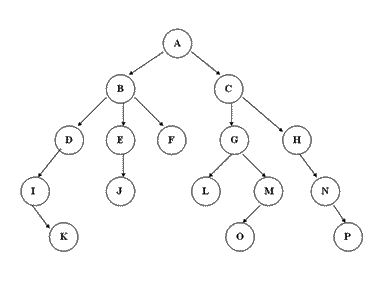

## 数据结构--树
### 定义
由n（n>=1）个有限节点组成一个具有层次关系的集合。把它叫做“树”是因为它看起来像一棵倒挂的树，也就是说它是根朝上，而叶朝下的。它具有以下的特点：
> 每个节点有零个或多个子节点；

> 没有父节点的节点称为根节点；

> 每一个非根节点有且只有一个父节点；

> 除了根节点外，每个子节点可以分为多个不相交的子树；

---

### 常用的树结构
- [二叉树(Binary Tree)](1.binaryTree.md)
- [二叉搜索树(Binary Search Tree)](2.binarySearchTree.md)
- [平衡二叉树(AVL Tree)](3.AVLTree.md)
- B-树(B Tree)
- B+树(B+ Tree)
- B\*树(B\* Tree)
- 红黑树(Red black tree)
- 字典树(Trie Tree)