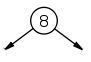
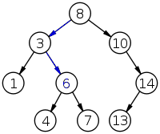
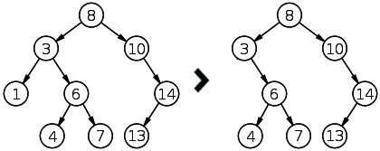
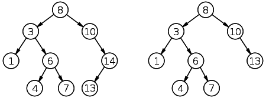
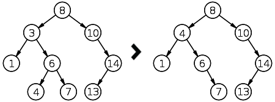

## 数据结构--二叉查找树(二叉排序树或二叉搜索树)
### 定义
一棵空树或者具有如下性质的[二叉树](1.binaryTree.md)
> 若任意节点的左子树不为空，则左子树上所有节点的值均小于它的根节点的值

> 若任意节点的右子树不为空，则右子树上所有节点的值均大于它的根节点的值

> 任意节点的左、右子树也为二叉查找树

> 没有键值相等的节点（no duplicate nodes）

对二叉查找树进行中序遍历，即可得到有序的数列<br>
二叉查找树的优势在于查找和插入的时间复杂度低,复杂度为O(logn),最坏的情况下是O(n)


### 树和树节点
```go
// go语言
type BSTree struct {
    Root *TreeNode
}

type TreeNode struct {
    Data  int        // 存储节点数据
    Left  *TreeNode  // 左子树
    Right *TreeNode  // 右子树
}
```

### 树节点操作
#### 创建
```go
func NewTreeNode(d int) *TreeNode {
    return &TreeNode{Data: d}
}
```

root = NewTreeNode(8)<br>


#### 插入
```go
func (node *TreeNode) Insert(d int) error {
    if node == nil {
        return errors.New("cann't insert data into a nil node")
    }

    switch {
        case d < node.Data:
            if node.Left == nil {
                node.Left = NewTreeNode(d)
            } else {
                node.Left.Insert(d)
            }
        
        case d > node.Data:
            if node.Right == nil {
                node.Right = NewTreeNode(d)
            } else {
                node.Right.Insert(d)
            }
        
        default:
            return errors.New("data already exists")
    }

    return nil
}
```

root.insert(3)<br>
root.insert(10)<br>
root.insert(1)<br>
<br>
root.insert(6)<br>
root.insert(4)<br>
root.insert(7)<br>
root.insert(14)<br>
root.insert(13)<br>


#### 查找
```go
func (node *TreeNode) Search(d int) *TreeNode {
    if node == nil {
        return nil
    }

    switch {
        case d < node.Data:
            return node.Left.Search(d)

        case d > node.Data:
            return node.Right.Search(d)

        default:
            return node
    }
}
```

node = root.Search(6)<br>


#### 删除
```go
func (node *TreeNode) Delete(d data, parent *TreeNode) bool {
    // 找到要删除的节点
    n := node.Search(d)
    if n == nil {
        return false
    }

    // 左节点为空,右节点也为空
    if n.Left == nil && n.Right == nil {
        if parent.Left == n {
            parent.Left = nil
        } else {
            parent.Right = nil
        }

    } else if n.Left == nil {
    // 左节点为空,右节点不为空
        if parent.Left == n {
            parent.Left = n.Right
        } else {
            parent.Right = n.Right
        }

    } else if n.Right == nil {
    // 左节点不为空,右节点为空
        if parent.Left == n {
            parent.Left = n.Left
        } else {
            parent.Right = n.Left
        }

    } else {
    // 左右节点都不为空(右子树中最小的节点的值替换删除节点的值,然后删除最小的节点)
        successor = n.Right.MinNode()
        n.Data = successor.Data

        n.Right.Delete(n.Data, n.Right)
    }

    return true
}
```

```go
// 获取节点的最小子节点
func (node *TreeNode) MinNode() *TreeNode {
    if node == nil {
        return node
    }

    return node.Left.MinNode()
}

// 获取节点的最大子节点
func (node *TreeNode) MaxNode() *TreeNode {
    if node == nil {
        return node
    }

    return node.Right.MaxNode()
}

```

> 删除节点左节点为空 , 右节点也为空--***直接删除该节点***



> 删除节点只有一个子节点(右节点或者左节点)--***用存在的子节点代替该节点***



> 删除节点左右子节点都不为空--***用删除节点中的左子树中最大的节点或者右子树中最小的节点的值替换删除节点的值(此时存在重复的节点),然后删除最大的节点或者最小的节点***

