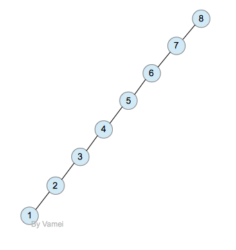

## 数据结构--AVL树(自平衡二叉查找树)
### 定义
AVL树是自平衡[二叉查找树](2.binarySearchTree)，它或者是一棵空树，或者满足下面<font color=red>性质</font>的二叉树:
> 左右两棵子树的高度差的绝对值不超过1

> 左右两棵子树也都是AVL树

由于二叉树查找的复杂度与高度相关, 而平衡二叉树的高度最低, 所以查找、插入、删除等操作的复杂度在平均和最坏情况下都是O(logn)。增加和删除可能需要通过一次或多次**树旋转**来重新平衡这个树。




### 数据结构
```go
type TreeNode struct {
	height int
	Data   int
	Left   *TreeNode
	Right  *TreeNode
}

// 新建节点
func NewTreeNode(d int) *TreeNode {
	return &TreeNode{
		Data:  d,
	}
}

// 复制节点
func (n *TreeNode) copy() *TreeNode {
	if n == nil {
		return nil
	}
	
	newNode := new(TreeNode)
	*newNode = *n
	
	return newNode
}

// 节点高度
func (n *TreeNode) Height() int {
	if n == nil {
		return -1
	}

	return n.height
}

// 更新节点高度
func (n *TreeNode) updateHeight(recursive bool) {
	if recursive {
		if n.Left != nil {
			n.Left.updateHeight(true)
		}
		
		if n.Right != nil {
			n.Right.updateHeight(true)
		}
	}
	
	n.height = max(n.Left.Height(), n.Right.Height()) + 1
}

type AVLTree struct {
	Root   *TreeNode
}

// 新建AVL树(空树)
func NewAVLTree() *AVLTree {
	return &AVLTree{}
}
```

### 平衡因子
节点的平衡因子是它的左节点的高度减去它的右节点的高度<br>
带有平衡因子1、0或 -1的节点被认为是平衡的。带有平衡因子 -2或2的节点被认为是不平衡的，并需要重新平衡这个树
```go
func (n *TreeNode) balanceFactor() int {
	if n == nil {
		return 0
	}

	return n.Left.Height() - n.Right.Height()
}

```

### 操作
#### 插入
插入过程中有四种种情况可能导致二叉查找树不平衡:<br>
*假设平衡二叉树插入节点而失去平衡的最小子树的根节点为<font color=red>N</font>(第一个被破坏平衡的节点)*<br>

> LL(左左): 在<font color=red>N</font>(图中的5节点)的左节点的左子树上插入,导致N节点的平衡因子由1变成2. <br>


> RR(右右): 在<font color=red>N</font>(图中的5节点)的右节点的右子树上插入,导致N节点的平衡因子由1变成2. 与左左对称 <br>

> LR(左右): 在<font color=red>N</font>(图中的5节点)的左节点的右子树上插入,导致N节点的平衡因子由1变成2. <br>


> RL(右左): 在<font color=red>N</font>(图中的5节点)的右节点的左子树上插入,导致N节点的平衡因子由1变成2. 与左右对称 <br>

```go
func (n *TreeNode) Insert(d int) bool {

	if n == nil {
		return false
	}

	switch {
		case d < n.Data:
			if n.Left == nil {
				n.Left = NewTreeNode(d)
			} else {
				n.Left.Insert(d)
			}

		case d > n.Data:
			if n.Right == nil {
				n.Right = NewTreeNode(d)
			} else {
				n.Right.Insert(d)
			}

		default:
			return false 
	}

	// 更新节点高度
	n.updateHeight(false)

	// 重新平衡节点
	n.rebalance()

	return true
}
```

#### 旋转
*根据上面四种情况可能导致的不平衡，可以通过旋转使之变平衡*
```go
// 重新平衡节点
func (n *TreeNode) rebalance() {
	if n.balanceFactor() > 1 {
		// 左左
		if n.Left.balanceFactor() > 0 {
			n.singleRotateWithRight()
		// 左右
		} else {
			n.doubleRotateWithRight()
		}
	} else if n.balanceFactor() < -1 {
		// 右右
		if n.Right.balanceFactor() < 0 {
			n.singleRotateWithLeft()
		// 右左
		} else {
			n.doubleRotateWithLeft()
		}
	}
}
```

>  左旋转--解决RR(右右)情况

~~类似右旋转~~

```go
func (n *TreeNode) singleRotateWithLeft() {
	var newRoot *TreeNode

	// 最小不平衡树的新根节点为原根节点的右节点
	*newRoot = *n.Right
	// 最小不平衡树的原根节点的右节点更新
	*n.Right = *newRoot.Left
	// 最小不平衡树的新根节点的左节点更新
	*newRoot.Left = *n

	*n = *newRoot
	n.updateHeight(true)
}
```

> 右旋转--解决LL(左左)情况

 <br>
通过右旋转，3成为新的根节点，2,5为3的左右子节点。子树重新成为AVL树。该子树的深度减小1，这将自动修正2带给节点6和1带来的不平衡。<br>
<font color=red>旋转效果</font>:<br>
 <br>
**\*为了保持二叉树的性质，子树B过继给了节点5，变成节点5的左子树(因为子树B大于3小于5)**

```go
func (n *TreeNode) singleRotateWithRight() {
	var newRoot *TreeNode

	// 最小不平衡树的新根节点为原根节点的左节点
	*newRoot = *n.Left
	// 最小不平衡树的原根节点的左节点更新
	*n.Left = *newRoot.Right
	// 最小不平衡树的新根节点的右节点更新
	*newRoot.Right = *n

	*n = *newRoot
	n.updateHeight(true)
}
```

> 左右旋转(先左旋后右旋)--解决LR(左右)情况

 <br>
~~以5为根节点的子树向右单旋转后，树将以3为根节点，4,5为子节点。4比3大，却是3的左子节点~~ 不符合二叉树的性质 <br>
但基于相似的原则，有一个解决方案双旋转(先左旋后右旋): <br>
**先以3(插入节点所在的子节点或者根节点5中高度大的子节点)为根节点的子树先进行一次向左的单旋转，然后将5为根节点的子树进行了一次向右的单旋转。这样恢复了树的ACL性质。**

```go
func (n *TreeNode) doubleRotateWithRight() {
	n.Left.singleRotateWithLeft()
	n.singleRotateWithRight()
}
```

> 右左旋转(先右旋后左旋)--解决RL(右左)情况

~~类似左右旋转~~

```go
func (n *TreeNode) doubleRotateWithLeft() {
	n.Right.singleRotateWithRight()
	n.singleRotateWithLeft()
}
```

#### 查找
> 和二叉查找树查找操作一样

```go
func (n *TreeNode) Search(d int) (int, bool) {
	if n == nil {
		return 0, false
	}

	switch {
        case d < n.Data:
            return n.Left.Search(d)

        case d > n.Data:
            return n.Right.Search(d)

        default:
            return n.Data, true
    }
} 
```

#### 删除

```go
func (n *TreeNode) Delete(d int, parent *TreeNode) bool {
    if n == nil {
        return false
    }

    // 根节点删除,需要树来做
    if parent == nil {
        return false
    }

    switch {
        case d < n.Data:
            if !n.Left.Delete(d, n) {
            	return false
            }

        case d > n.Data:
            if !n.Right.Delete(d, n) {
                return false
            }

        default:
            // 左节点为空,右节点也为空
            if n.Left == nil && n.Right == nil {
                if parent.Left == n {
                    parent.Left = nil
                } else {
                    parent.Right = nil
                }

            } else if n.Left == nil {
            // 左节点为空,右节点不为空
                if parent.Left == n {
                    parent.Left = n.Right
                } else {
                    parent.Right = n.Right
                }

            } else if n.Right == nil {
            // 左节点不为空,右节点为空
                if parent.Left == n {
                    parent.Left = n.Left
                } else {
                    parent.Right = n.Left
                }

            } else {
            // 左右节点都不为空(右子树中最小的节点的值替换删除节点的值,然后删除最小的节点)
                successor := n.Right.MinNode()
                n.Data = successor.Data

                n.Right.Delete(n.Data, n)
            }
    }

    parent.updateHeight(false)
    parent.rebalance()

    return true

}

```

### 代码
[https://play.golang.org/p/wioMGfC08M](https://play.golang.org/p/QyIYNYKcZp)

### 优缺点
优点:<br>
> AVL树的高度平衡，查找最坏的复杂度为O(logN)

缺点:<br>
> 在插入和删除节点更容易引起树的不平衡，因此在大量数据需要插入或者删除时，AVL需要rebalance的频率会更高(相比于[RBTree](4.RBTree.md))

### 适用场景
插入和删除操作表少，查询操作比较多的场景

### 参考
[Vamei--纸上谈兵: AVL树](http://www.cnblogs.com/vamei/archive/2013/03/21/2964092.html)