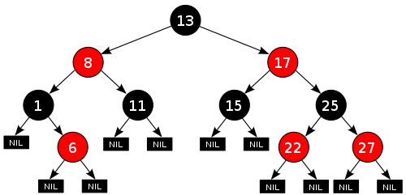

## 数据结构--红黑树(Red-Black Tree)

### 定义
一种特殊的自平衡二叉查找树(接近平衡的二叉查找树)。红黑树的每个节点上都有存储位表示节点的颜色，可以是红(Red)或黑(Black)。

### 性质
> 1.每个节点或者是黑色,或者是红色<br>
> 2.根节点是黑色<br>
> 3.每个叶子节点(为Nil的节点）是黑色<br>
> 4.如果一个节点是黑色的,那么它的子节点必须是黑色的 => 不存在父子节点都是红色<br>
> 5.从一个节点到它的所有叶子节点(为Nil的节点)包含的黑色节点数相同 => 从节点到最远的叶子的路径不超过从节点到最近叶子的路径的两倍。<br>

一棵含有n个节点的红黑树的高度至多为2log(n+1) [证明参考](http://www.cnblogs.com/skywang12345/p/3245399.html#a2)<br>
因此查找、插入、删除等操作的复杂度O(logn)



### 数据结构
```
// 节点
type TreeNode struct {
	Data   int
	IsRed  bool
	Parent *TreeNode
	Left   *TreeNode
	Right  *TreeNode
}
```

### 操作
#### 旋转
红黑树插入和删除节点时，红黑树发生变化，可能不再满足红黑树。有时需要通过**旋转**来让其再次重新成为红黑树。

> 1.左旋转

<br>
X进行左旋，将X变成一个左节点

> 2.右旋转

<br>
Y进行右旋，将Y变成一个右节点

#### 插入
步骤:
> 1. 将红黑树看做一个二叉查找树，将节点插入
> 2. 将插入的节点着色为红色(为什么?)
> 3. 可能违背性质4，若违背，通过旋转或者着色等操作，使之重新成为红黑树

插入节点后，可以划分为以下三种情况：
> 1. 插入的为根节点

**操作:** 直接把该节点着色为黑色
> 2. 插入节点的父节点为黑色

**操作:** 无需操作，仍是红黑树
> 3. 插入节点的父节点为红色(也有三种情况)

序号 | 情况说明 | 操作    
--- | --------- | -----------    
1⃣️ | 节点的父节点是红色，且节点的叔叔节点也是红色 | 1.将“父节点”设为黑色<br> 2.将“叔叔节点”设为黑色<br> 3.将“祖父节点”设为“红色”<br> 4.将“祖父节点”设为“当前节点”,继续操作
2⃣️ | 节点的父节点是红色，叔叔节点是黑色，且节点是其父节点的右孩子 | 1.将“父节点”作为“新的当前节点”<br> 2.以“新的当前节点”为支点进行左旋
3⃣️ | 节点的父节点是红色，叔叔节点是黑色，且节点是其父节点的左孩子 | 1.将“父节点”设为“黑色”<br> 2.将“祖父节点”设为“红色”<br> 3.以“祖父节点”为支点进行右旋

\*_解释_:

#### 删除
从红黑树上删除节点，先将其作为二叉查找树删除节点，然后通过旋转和着色来让其重新成为红黑树。

#### 查找

### 应用场景
> nginx中，用红黑树管理timer

> Java中的TreeMap和TreeSet

> C++ STL中的：map,multimap,multiset

> linux进程调度Completely Fair Scheduler,用红黑树管理进程控制块

